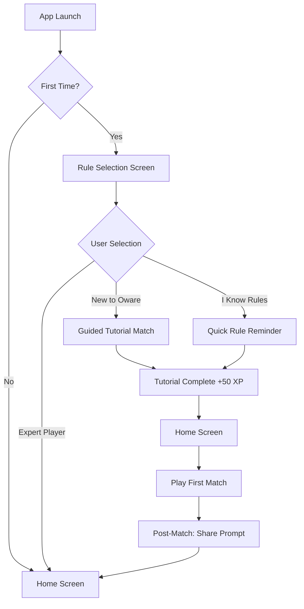
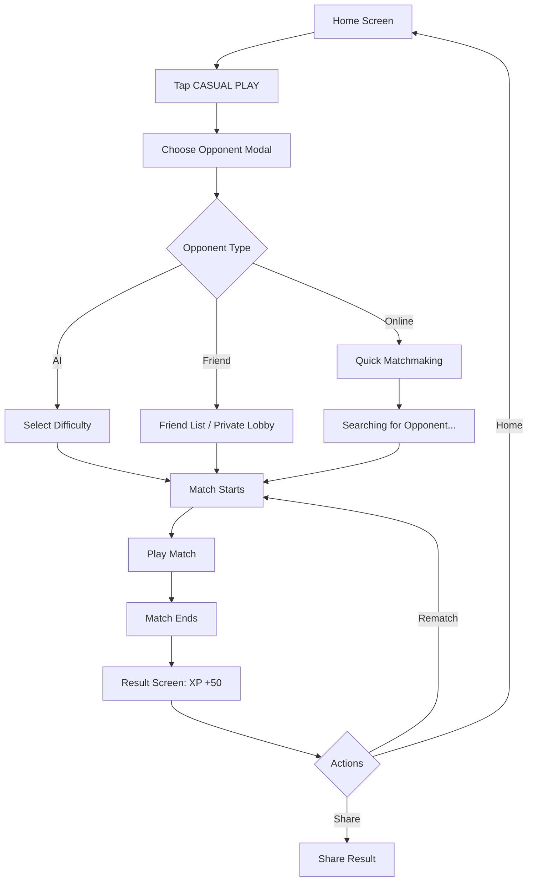
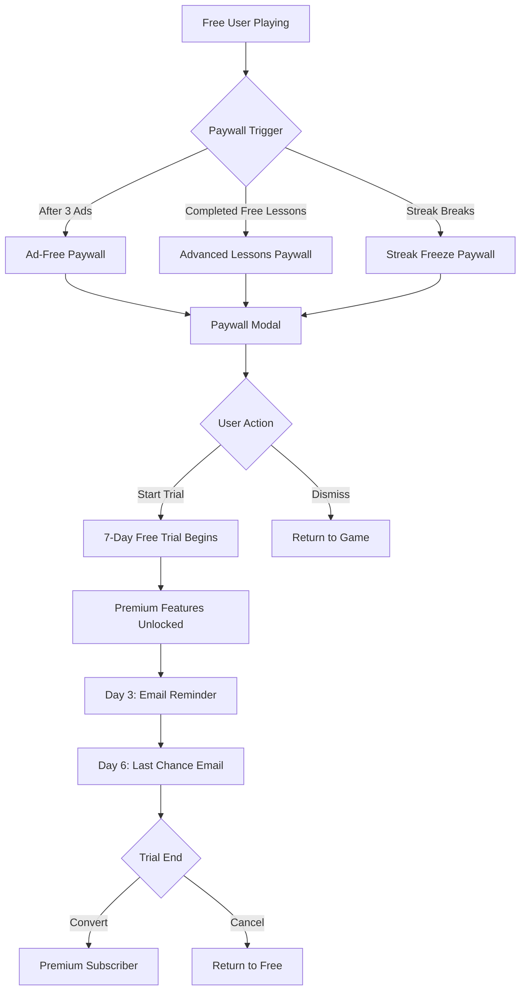
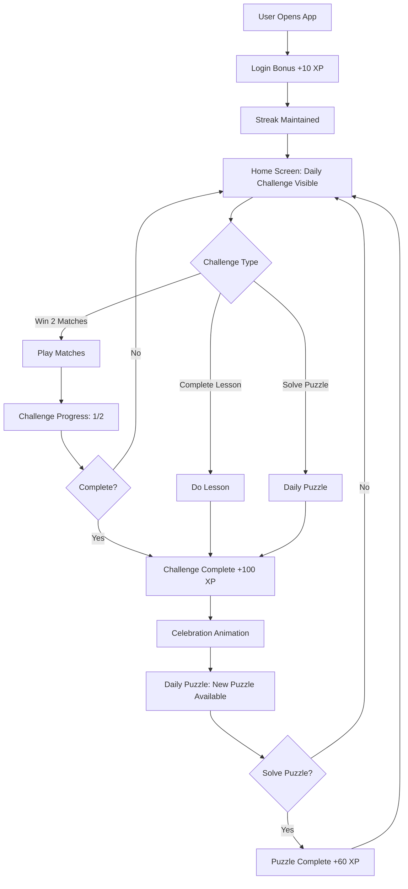

# UX Wireframes & User Flows - Social Oware Academy

Visual specifications and user flow diagrams for all key screens and interactions.

---

## 🎨 Design Principles

### Visual Language
- **Stunningly Beautiful:** Minimalist, clean, modern
- **Accessible:** Clear hierarchy, readable fonts (TextMeshPro), high contrast
- **Cultural:** Subtle West African design elements (patterns, colors)
- **Responsive:** Works on all screen sizes (iPhone SE to iPad Pro)

### Color Palette (Conceptual - for post-MVP polish)
- **Primary:** Warm earth tones (terracotta, ochre, deep brown)
- **Secondary:** Vibrant accents (gold, emerald, azure)
- **Neutral:** Off-white background, charcoal text
- **Semantic:** Green (success), Red (danger), Blue (info)

### Typography
- **Headers:** Bold, geometric sans-serif
- **Body:** Clean, readable sans-serif (18-20pt minimum for mobile)
- **Numbers:** Tabular figures for stats

---

## 📱 Screen Hierarchy

```
App Launch
    ↓
Splash Screen (1-2 sec)
    ↓
[First Launch] → Rule Selection Screen → Guided Tutorial → Home Screen
[Returning] → Home Screen (directly)
    ↓
┌──────────────────────────────────────────────┐
│            HOME SCREEN (Hub)                 │
└────┬─────────────────────────────────────┬───┘
     │                                     │
     ├─→ Play Mode Selection              ├─→ Profile
     ├─→ Training (Lessons)               ├─→ Leaderboards
     ├─→ Daily Puzzle                     ├─→ Friends
     ├─→ Settings                         └─→ Shop (Premium)
     └─→ Lobby (Matchmaking/Private)
```

---

## 🖼️ Screen Wireframes (Text-Based)

### 1. Home Screen

```
┌────────────────────────────────────────┐
│ ≡ [Avatar] PlayerName     [Friends 🔔]│  ← Header
│    Level 12 | ████████░░ 80/100 XP    │
├────────────────────────────────────────┤
│                                        │
│  🔥 12-Day Streak!                     │
│                                        │
│  ┌──────────────────────────────────┐ │
│  │ Today's Challenge: Win 2 Matches │ │  ← Daily Challenge Banner
│  │ Progress: ██░░ 1/2                │ │
│  │ Reward: 50 XP                     │ │
│  └──────────────────────────────────┘ │
│                                        │
│  ┌─────────────┐  ┌─────────────────┐ │
│  │   CASUAL    │  │    RANKED       │ │  ← Play Buttons
│  │   PLAY      │  │    PLAY         │ │
│  │  [🎮 Icon]  │  │  [🏆 Icon]      │ │
│  └─────────────┘  └─────────────────┘ │
│                                        │
│  ┌─────────────┐  ┌─────────────────┐ │
│  │  TRAINING   │  │  DAILY PUZZLE   │ │
│  │  LESSONS    │  │  [🧩 Icon]      │ │
│  │  [📚 Icon]  │  │  New! ⭐         │ │
│  └─────────────┘  └─────────────────┘ │
│                                        │
├────────────────────────────────────────┤
│  [📊 Leaderboard] [👤 Profile] [🛒]  │  ← Footer Nav
└────────────────────────────────────────┘
```

**Key Elements:**
- **Header:** Avatar (tap for profile), username, friends icon (notification badge if requests)
- **XP Bar:** Visual progress toward next level
- **Streak Display:** Fire emoji + count (emphasizes daily habit)
- **Daily Challenge:** Collapsible banner, progress bar, clear reward
- **Play Buttons:** Large, tappable (60x60pt minimum), icon + text
- **Footer Nav:** Persistent navigation to key sections

---

### 2. Play Mode Selection (Overlay/Modal)

```
┌────────────────────────────────────────┐
│           CHOOSE OPPONENT              │
│                                     [X]│  ← Close button
├────────────────────────────────────────┤
│                                        │
│  🤖 Play vs AI                         │
│  ┌──────────────────────────────────┐ │
│  │ [Beginner]  [Intermediate]       │ │
│  │ [Advanced] 👑 Premium Only       │ │
│  └──────────────────────────────────┘ │
│                                        │
│  👥 Play with Friend                   │
│  ┌──────────────────────────────────┐ │
│  │ [Challenge Friend]               │ │  ← Opens friend list
│  │ [Create Private Lobby]           │ │  ← Generates room code
│  │ [Join Private Lobby]             │ │  ← Enter code
│  └──────────────────────────────────┘ │
│                                        │
│  🌐 Play Online                        │
│  ┌──────────────────────────────────┐ │
│  │ [Quick Match] (Casual)           │ │  ← Instant matchmaking
│  │ [Ranked Match] 🔒 Level 5+       │ │  ← Requires Level 5
│  └──────────────────────────────────┘ │
│                                        │
└────────────────────────────────────────┘
```

**Key Elements:**
- **Modal overlay:** Darkened background (0.7 alpha)
- **Clear sections:** AI, Friend, Online
- **Lock icons:** Visual indicator for gated content
- **Premium badge:** 👑 for Premium-only features

---

### 3. Match Screen (In-Game)

```
┌────────────────────────────────────────┐
│ [☰Menu]  Player1 (1450) vs Player2... │  ← Header
│                                        │
├────────────────────────────────────────┤
│           OPPONENT'S SIDE              │
│  ┌────┐ ┌────┐ ┌────┐ ┌────┐ ┌────┐  │
│  │ 4  │ │ 3  │ │ 2  │ │ 5  │ │ 1  │  │  ← Opponent's pits
│  └────┘ └────┘ └────┘ └────┘ └────┘  │
│                                        │
│          🏺 Opponent: 12 captured      │  ← Capture count
│ ═══════════════════════════════════════│  ← Board divider
│          🏺 You: 8 captured            │
│                                        │
│  ┌────┐ ┌────┐ ┌────┐ ┌────┐ ┌────┐  │
│  │ 6  │ │ 0  │ │ 1  │ │ 7  │ │ 2  │  │  ← Your pits (tappable)
│  └────┘ └────┘ └────┘ └────┘ └────┘  │
│           ▲ YOUR TURN ▲               │  ← Turn indicator
├────────────────────────────────────────┤
│  💬 [Emote Menu]       [Forfeit]      │  ← Bottom actions
└────────────────────────────────────────┘
```

**Key Elements:**
- **Board:** Central focus, clear pit ownership (top/bottom)
- **Seed counts:** Large, readable numbers
- **Capture tracking:** Visual indicator (vase/bowl icon) + count
- **Turn indicator:** Glowing border or arrow pointing to active player
- **Emote button:** Opens preset emote menu (no text chat)
- **Menu:** Pause, settings, forfeit options

**Animation Notes:**
- Seeds "hop" from pit to pit during sowing (0.1s per pit)
- Captures trigger particle effect (seeds fly to capture zone)
- Turn transitions: Subtle glow/pulse on active player

---

### 4. Lesson Screen (Training Mode)

```
┌────────────────────────────────────────┐
│  [← Back]  LESSONS                     │
├────────────────────────────────────────┤
│  Mastery: 60% (18/30 stars)            │  ← Progress tracker
├────────────────────────────────────────┤
│                                        │
│  BEGINNER (Free)                       │
│  ┌─────┐ ┌─────┐ ┌─────┐ ┌─────┐      │
│  │ 1.  │ │ 2.  │ │ 3.  │ │ 4.  │      │
│  │ ⭐⭐⭐│ │ ⭐⭐  │ │ ⭐⭐⭐│ │ ⭐   │      │  ← Star rating
│  └─────┘ └─────┘ └─────┘ └─────┘      │
│  └─────┘                               │
│                                        │
│  INTERMEDIATE (Level 10+)              │
│  ┌─────┐ ┌─────┐ ┌─────┐ ┌─────┐      │
│  │ 6.  │ │ 7.  │ │ 8.🔒│ │ 9.🔒│      │  ← Locked lessons
│  │ ⭐⭐  │ │ ☆☆☆ │ │     │ │     │      │
│  └─────┘ └─────┘ └─────┘ └─────┘      │
│                                        │
│  ADVANCED (Premium Only) 👑            │
│  ┌─────┐ ┌─────┐ ┌─────┐ ┌─────┐      │
│  │11.🔒│ │12.🔒│ │13.🔒│ │14.🔒│      │
│  │     │ │     │ │     │ │     │      │
│  └─────┘ └─────┘ └─────┘ └─────┘      │
│                                        │
│  [Unlock Premium Lessons →]           │  ← Paywall CTA
└────────────────────────────────────────┘
```

**Key Elements:**
- **Mastery %:** Motivational progress tracker
- **Lesson tiles:** Grid layout, numbered, star rating visible
- **Lock icons:** Clear indication of gated content
- **Tier labels:** Beginner/Intermediate/Advanced + unlock requirements
- **Paywall CTA:** Non-intrusive, contextual placement

**Lesson Flow (When tapped):**
1. **Intro Screen:** Text explanation + diagrams
2. **Interactive Puzzle:** Oware board with objective ("Capture 6 seeds in 2 moves")
3. **Feedback:** Correct/Incorrect + explanation
4. **Summary:** Stars earned (1-3), XP reward, next lesson preview

---

### 5. Leaderboard Screen

```
┌────────────────────────────────────────┐
│  [← Back]  LEADERBOARD                 │
├────────────────────────────────────────┤
│  [Global] [Friends] [Country]          │  ← Tab navigation
├────────────────────────────────────────┤
│  Your Rank: #47 (Gold Tier)            │  ← Player's position
├────────────────────────────────────────┤
│                                        │
│  1.  [🥇] MasterPlayer    2456 🏆      │  ← Top 3 special
│  2.  [🥈] ChessQueen      2398 🏆      │
│  3.  [🥉] StrategyKing    2287 🏆      │
│  ─────────────────────────────────────│
│  4.  [4️⃣ ] ProGamer       2156 💎      │
│  5.  [5️⃣ ] OwareAce       2089 💎      │
│  ...                                   │
│  45. [45] CoolPlayer99    1478 🟡      │
│  46. [46] QuickThink      1455 🟡      │
│  47. [▶️] YOU             1450 🟡      │  ← Highlighted
│  48. [48] FunPlayer       1448 🟡      │
│  49. [49] BoardMaster     1432 🟡      │
│  ...                                   │
│  100.[100] LastPlace      1012 ⚪      │
│                                        │
└────────────────────────────────────────┘
```

**Key Elements:**
- **Tab navigation:** Switch between Global/Friends/Country
- **Player's rank:** Always visible at top (sticky header)
- **Top 3:** Visual distinction (medals, larger font)
- **Rank badges:** Visual indicators (🏆💎🟡⚪ for tiers)
- **Scrollable list:** Smooth scrolling, centers on player's position
- **Avatar + Username:** Tappable for profile view (future feature)

---

### 6. Profile Screen

```
┌────────────────────────────────────────┐
│  [← Back]  YOUR PROFILE                │
├────────────────────────────────────────┤
│        ┌─────────────┐                 │
│        │   [Avatar]  │                 │  ← Avatar image
│        └─────────────┘                 │
│                                        │
│         PlayerName                     │
│         Level 12 | Gold Rank 🟡        │
│         ELO: 1450                      │
│         12-Day Streak 🔥               │
│                                        │
├────────────────────────────────────────┤
│  STATS                                 │
│  ┌─────────────────────────────────┐  │
│  │ Matches Played: 87              │  │
│  │ Win Rate: 64% (56W-31L)         │  │
│  │ Lessons Completed: 8/15         │  │
│  │ Mastery: 60%                    │  │
│  │ Highest Streak: 20 days         │  │
│  └─────────────────────────────────┘  │
│                                        │
│  ACHIEVEMENTS                          │
│  ┌─────┐ ┌─────┐ ┌─────┐ ┌─────┐     │
│  │ 🏆  │ │ 🔥  │ │ 📚  │ │ 🎯  │     │  ← Badge icons
│  │First│ │7-Day│ │Tutor│ │100  │     │
│  │ Win │ │Strek│ │Comp │ │Wins │     │
│  └─────┘ └─────┘ └─────┘ └─────┘     │
│                                        │
│  [Edit Profile] [Settings]            │
└────────────────────────────────────────┘
```

**Key Elements:**
- **Avatar:** Large, centered, tappable for customization (future)
- **Core stats:** Level, Rank, ELO, Streak
- **Detailed stats:** Win rate, matches, lessons
- **Achievement showcase:** Grid of unlocked badges
- **Action buttons:** Edit profile, settings

---

## 🔄 User Flows (Mermaid Diagrams)

### Flow 1: First-Time User Onboarding



---

### Flow 2: Casual Match Flow



---

### Flow 3: Premium Conversion Flow



---

### Flow 4: Daily Engagement Loop



---

## 📐 Responsive Design Considerations

### Screen Size Breakpoints

**Mobile Portrait (Default):**
- iPhone SE (375x667) minimum
- iPhone 13 (390x844) target
- Android (360x640+) common

**Mobile Landscape:**
- Board rotates 90°, UI adapts (side panels)
- Less common, lower priority

**Tablet (iPad):**
- Larger UI elements, more whitespace
- Two-column layouts where applicable
- Higher resolution assets

**WebGL (Desktop):**
- 16:9 aspect ratio (1280x720 minimum)
- Mouse + keyboard support
- Larger text, more spacing

---

### Accessibility Features

**Visual:**
- High contrast mode (toggle in settings)
- Colorblind mode (adjust rank tier colors)
- Font size scaling (small/medium/large)
- Seed count always visible (not just color-coded)

**Audio:**
- Sound effects toggle
- Music toggle
- Haptic feedback toggle (mobile)

**Interaction:**
- Minimum tap target: 44x44pt (iOS HIG)
- Undo button (confirm before forfeit)
- Tutorial replayable anytime

---

## 🎬 Animation Principles

### Micro-interactions
- **Button press:** Scale down 0.95x + bounce back (0.2s)
- **Page transition:** Slide left/right (0.3s ease-in-out)
- **Modal open:** Fade in + scale from 0.8x → 1x (0.25s)
- **Level up:** Confetti particle effect + XP bar fill animation (1s)

### Gameplay Animations
- **Seed sowing:** Seeds hop from pit to pit (0.1s per pit)
- **Capture:** Seeds fly to capture zone with arc trajectory (0.5s)
- **Turn change:** Glowing pulse on active player's side (1s fade)
- **Game end:** Winning player side glows, confetti burst (2s)

### Performance
- 60 FPS target (16ms per frame)
- Use Unity's DOTween for smooth tweening
- Particle systems pooled (max 50 particles at once)

---

**Document Version:** 1.0
**Last Updated:** 2025-10-14
**Status:** UX flows and wireframes defined

*"Beautiful, accessible, delightful"*
